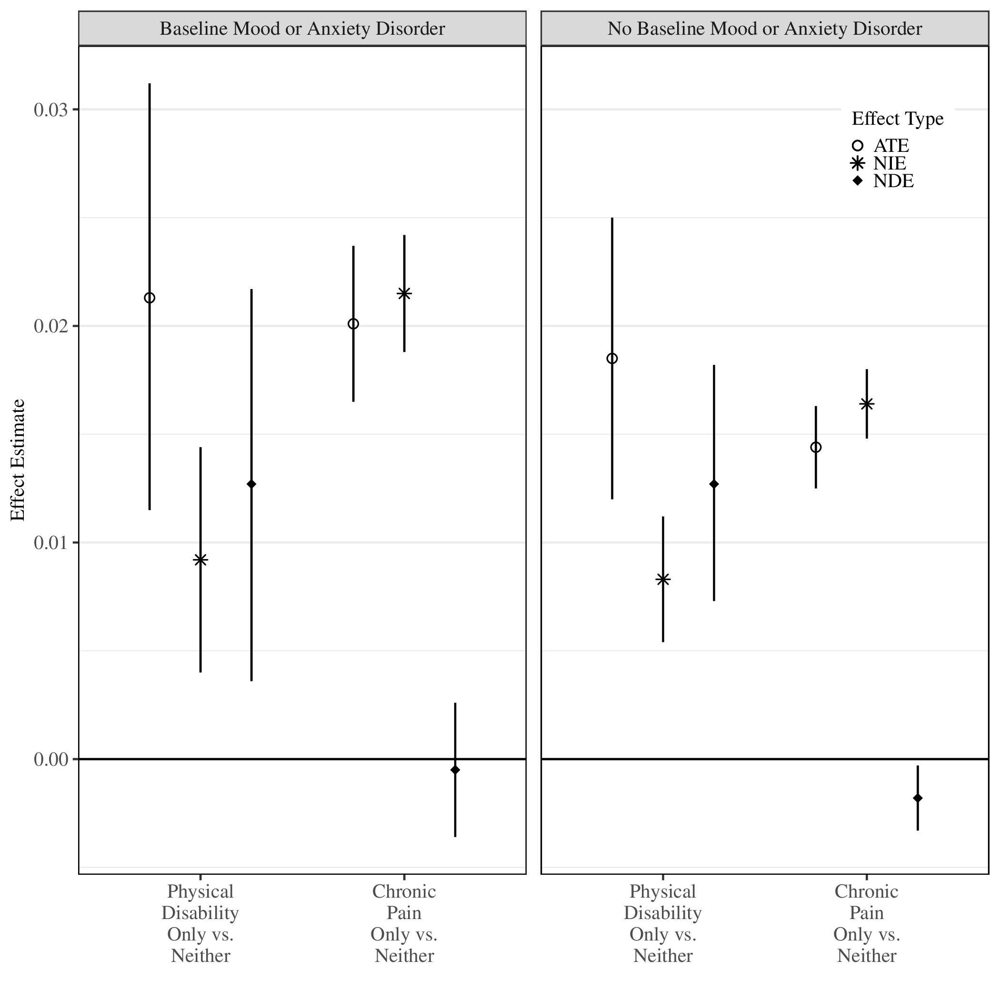

# How to choose an estimand: Real-world example {#estimandirl}

```{r}
#| label: load-renv
#| echo: false
#| message: false
renv::autoload()
library(here)
```

## 1. Extent to which the risk of OUD conferred by chronic pain operates through pain management treatments

{width="120%" fig-align="center"}

This application was explored in detail by @rudolph2025mediation.

### Getting specific about the question

To what extent does the total effect of chronic pain on risk of OUD operate
through prescription medications for pain management and physical therapy,
treated as a bundle?

1. **What estimand do we want?**

- Does $M=m$ (i.e., same value) for everyone make sense?
- Are we interested in estimating indirect effects?

$\rightarrow$ So, *not* a controlled direct effect.

- Do we have an intermediate confounder?
  - Not really, because we: (1) consider all initial treatments following
    chronic pain diagnosis and (2) stratify by whether the patient has an
    anxiety or depressive disorder.

$\rightarrow$ So, could estimate natural direct and indirect effects

- Estimands:
  - Direct effect: $\E(Y_{1, M_0} - Y_{0, M_0})$
  - Indirect effect: $\E(Y_{1, M_1} - Y_{1, M_0})$

{width="80%"}

## 2. Extent to which the risk of OUD conferred by chronic pain operates through individual pain management treatments

{width="120%" fig-align="center"}

This application was explored in detail and described in @rudolph2025mediation.

### Getting specific about the question

To what extent does the overall effect of chronic pain on risk of OUD operate
through individual pain management treatments, controlling for co-occurring or
prior pain treatments?

1. **What estimand do we want?**

- Does $M=m$ (i.e., same value) for everyone make sense?
- Are we interested in estimating indirect effects?

$\rightarrow$ So, *not* controlled direct effect.

- Do we have an intermediate confounder?
  - Yes, likely multiple important ones, because we would like to control for
    prior or co-occurring pain treatments.
  - So likely do not have a single, binary intermediate confounder.
  - If we do have a binary intermediate confounder, would we assume
    monotonicity between the treatment and intermediate confounder?
    - No

$\rightarrow$ Randomized interventional direct and indirect effects.

- Do we want to estimate the path through treatment initiation ($Z$)?
  - Yes, so, *not* the conditional versions of these effects.
  - Here $G_a$ is a draw from the distribution of $M_a\mid W$.
- Estimands:
  - Direct effect: $\E(Y_{1,G_0} - Y_{0,G_0})$
  - Indirect effect: $\E(Y_{1,G_1} - Y_{1,G_0})$
- Need to incorporate multiple and continuous intermediate confounders

2. **What if the positivity assumption** $\P(A=a\mid W)>0$ violated?

   $\rightarrow$ Can't identify or estimate any of the above effects

   - But we can estimate the effect of some stochastic interventions, e.g.,
     incremental propensity score interventions (IPSIs)
     [@kennedy2018nonparametric]
   - Trade-off between feasibility and interpretation

3. **What if the exposure variable is continuous?**

   $\rightarrow$ All the above effects are defined for binary exposures

   - But we can estimate the effect of some stochastic interventions and
     general interventions on continuous exposures, like shift interventions
     (also called modified treatment policies) [@diaz2012population;
     @haneuse2013estimation; @diaz2018stochastic; @diaz2020causal]

4.  **What if the exposure is actually time-varying? What if the mediators
    and/or intermediate confounders are actually time-varying?**

    - this is hard! but we have two estimation strategies for this:
      - <https://github.com/nt-williams/lcmmtp>
      - <https://github.com/nt-williams/lcm>

